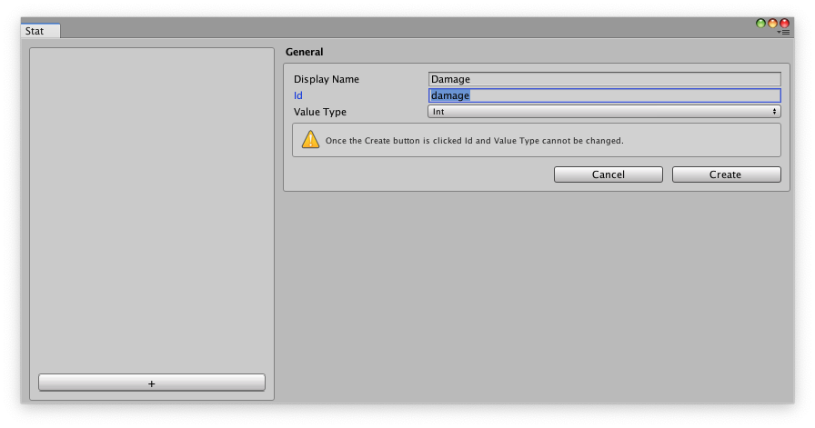

# Game Foundation tutorials

## Creating a Game Item Definition

* **Tip:** A Game Item Definition is any type of data that represents a gameplay concept you want Game Foundation to manage. While Game Foundation already provides built-in concepts like Inventory Item, for any generic concept in your own custom logic (such as a Player Character), defining them as Game Items allows you to take advantage of Game Foundation capabilities. Furthermore, when you want the same concepts to be shared by multiple systems, you can define them as Game Items and then use ‘Reference Definition’ to inherit that definition in other systems.

You can define a “coin” in the Game Item catalog and have your Store and Wallet systems refer to that Game Item Definition when they want to know what a coin is.

1. Open the **Game Item** window (menu: **Window → Game Foundation → Game Item**).
This is a tool for viewing and managing the contents of your Game Item catalog.


1. Click the **+** button to create a new Game Item and then enter a **Display Name** and an **Id**.  The display name can be modified later, but the ID will be permanent.


    * **Tip:**  String IDs are the easiest way to access object instances managed by Game Foundation (the alternative approach is hash number). We recognize that using string ID may not be the best solution in some cases. We’ll provide an alternative solution in a future release.

1. Click the **Create** button.
When a Game Item is created and added to the catalog, the **Detail Definitions** configuration options become available for that Game Item. A Detail in Game Foundation is a little bit of data added to a Game Item to describe it further, and details are often pertinent to specific systems.


## Using the Wallet with Soft Currency

### Creating a soft currency

* **Tip:** Soft Currency, also called regular currency or free currency, is a resource designed to be adequately accessible through normal gameplay, without having to make micro-transactions. We can keep track of these soft currencies with a virtual “wallet”.

1. Open the **Inventory** window (menu: **Window → Game Foundation → Inventory**).
This is a tool for viewing and managing the contents of your Inventory catalog.

    

1. Click the **+** button to create a new inventory item and then enter a **Display Name** and an **Id**. The display name can be modified later, but the ID will be permanent.

    

1. Click the **Create** button.
When an item is created and added to the catalog, the **Categories** and **Detail Definitions** configuration options become available for that item.

    

1. A currency item must contain a currency detail.
Click the **Add Details** button and then select **Currency Detail**.
The **Currency Detail** allow you to select the type of currency you want to use, but for this tutorial it can stay as the default value, **Soft**.

    

    Adding a Currency Detail also automatically adds an Analytics Detail.
    

1. Currency items can be added to the **Wallet** at runtime.
You can display currency items automatically in the player’s wallet at the start of the game by making the currency item a **Default Item** in the **Wallet** inventory.
Click on the **Inventories** tab and select **Wallet** from the list of inventory items (the **Main** and **Wallet** inventories are built-in to Game Foundation and can’t be deleted; you can create additional custom inventories as needed).

    

1. Each inventory contains a list of **Default Items** which are automatically added to that inventory when it is first instantiated at runtime.
In your **Wallet**, look under **Other Available Items** to find the **Coin** item, and click the **Add To Default Items** button next to it. This moves **Coin** to the **Default Items** list.

    

1. You can now set the quantity of the item to be added to the wallet when it is first created. In this case, the player will start with 100 coins in their wallet.

### Spending currency in-game
1. After creating your Coin and adding it to the Wallet in the previous tutorial sections, add the following script to a GameObject in a Scene:

    ```
    using UnityEngine;
    using UnityEngine.GameFoundation;

    public class WalletTest : MonoBehaviour
    {
        void Awake()
        {
            // you always need to call Initialize once per session
            GameFoundation.Initialize();
        }

        void Start()
        {
            // get the coin item by its ID
            InventoryItem coinItem = Wallet.GetItem("coin");

            Debug.LogFormat("coins in wallet at start: {0}", coinItem.quantity);

            coinItem.quantity -= 25;

            Debug.LogFormat("coins in wallet: {0}", coinItem.quantity);
        }
    }
    ```

1. Click **Play**. In the console, you’ll see the player’s wallet starting out with 100 coins in it. 25 coins are then removed, leaving them with 75 coins.

    

## Creating and applying Stats

* **Tip:** In Game Foundation you can use **Stats** to track and manage any numeric values in your gameplay, such as the health of a character, damage point of a weapon, or how many times the player has beat the level. Extending the stat system will allow you to apply formulas to stats based on modifiers and player progression.

1. Open the **Stat** window (menu: **Window → Game Foundation → Stat**).
This is a tool for viewing and managing the stats you want to adjust and persist at runtime.


1. For this example, we’ll use a sword with a **Damage** stat. Create the **Damage** stat by clicking the **+** button to create a new stat item with the following values:
    * **Display Name:** Damage
    * **Id:** damage
    * **Value Type:** Int


1. Click **Create**.
    * **Tip:** the numeric types currently supported are Float (C# System.Single) and Int (C# System.Int32). Once you choose which numeric type a stat is, it cannot be changed later.
1. Following the steps from the [Creating a Game Item](#creating-a-game-item) tutorial, create a Sword GameItem.


1. Click **Add Details** to add **Stat Details** to the Sword.


1. In the  Stat Details section, you’ll see a popup menu with your only stat, Damage, already selected.
Click **Add** to add the Damage stat to your Sword, and then set the **Default Value** as 10.
1. Using what you've learned from the tutorials so far, do the following:
    * Create a “Damage Increase” stat with a Value Type of Int.
    * Create a “Damage Buff Spell” Game Item.
    * Give the spell a “Damage Increase” stat with a default value of 1.
    * Create a “Sword” Inventory Item with the Reference Definition set to Sword, and add it as a default item in the Main inventory.
    * Create a “Damage Buff Spell” Inventory Item with the Reference Definition set to *Damage Buff Spell* and also add it to the Main inventory’s default items.

    

    

    


### Working with Stats at runtime
Now that we have a sword and a spell, let’s use those while playing the game. We’ll access the sword and spell in the inventory, and consume the spell in order to improve the damage stat of the sword:

    // let's use a consumable scroll spell to buff our weapon

    void Awake()
    {
        // you always need to call Initialize once per session
        GameFoundation.Initialize();
    }

    void SharpenSword()
    {
        // get the sword from inventory
        InventoryItem swordItem = Inventory.main.GetItem("sword");

        // get the scroll spell from inventory
        InventoryItem scrollItem = Inventory.main.GetItem("damageBuffSpell");

        // get the sword’s current damage
        int swordDamage = StatManager.GetIntValue(swordItem, "damage");

        // find out how much the scroll spell will increase the damage
        int damageIncrease = StatManager.GetIntValue(scrollItem, "damageIncrease");

        // increase this sword’s damage permanently
        StatManager.SetIntValue(swordItem, "damage", swordDamage + damageIncrease);

        // consume the scroll spell by removing it from the inventory
        Inventory.main.RemoveItem("damageBuffSpell");
    }


## Saving and loading the Game State

Now that you’re playing the game and your wallet values have changed, you’ll want to save your progress to make sure these changes persist when you return to the game.
When you initialize the inventory manager (as you did in the previous tutorial), you should also pass in a persistence provider. That will automatically load the state that was last saved. When you’re ready to save or load the game state, you can use methods like these:

    using UnityEngine;
    using UnityEngine.GameFoundation;

    public class SaveGame : MonoBehaviour
    {
        IDataPersistence localPersistence;

        void Awake()
        {
            // choose what format you want to use
            JsonDataSerializer dataSerializer = new JsonDataSerializer();

            // choose where and how the data is stored
            localPersistence = new LocalPersistence(dataSerializer);

            // tell Game Foundation to initialize using this
            // persistence system. Only call Initialize once per session.
            GameFoundation.Initialize(localPersistence);
        }

        public void Save()
        {
            GameFoundation.Save(localPersistence);
        }

        public void Load()
        {
            GameFoundation.Load(localPersistence);
        }
    }

## Defining Item details

* **Tip:** A Detail Definition is a predefined bit of data associated with a Game Item Definition. Details can be things like images, audio clips, metadata, etc. - anything that can be used to further identify an in-game item.

After doing the previous tutorials, you should be more comfortable with creating Game Items.
Now let's create a new Game Item, "apple," and then assign some sprites to it. We'll use two sprites:

* A thumbnail, used when we want to show an apple in a UI list;
* An enlargement of the thumbnail, used when we want to show a full-screen description of the apple.

1. Create a Game Item Definition with the id "apple".

    

1. On that new Game Item add a Sprite Assets Detail.

    

1. In the Sprite Assets Detail, click the "+" button twice to add two sprite entries.

    

1. These should have default keys of "Sprite" and "Sprite (1)". Change the keys to "thumbnail" and "enlargement" instead. For both entries, select an appropriate Sprite using either the object picker or by dragging Sprites from the Project window.

    

## Working with Detail Definitions at runtime

After following the steps in "Defining Item Details" above, the next thing you'd want to know is how to access that data in your game. Let's write some code to put the thumbnail sprite to use.

    public Sprite GetAppleThumbnail()
    {
        GameItemDefinition appleDef =
            GameFoundationSettings.database.gameItemCatalog.GetGameItemDefinition("apple");

        SpriteAssetsDetailDefinition appleSpriteDefs =
            appleDef.GetDetailDefinition<SpriteAssetsDetailDefinition>();

        // if the key doesn't exist, you'll get an error
        if (!appleSpriteDefs.ContainsKey("thumbnail"))
        {
            Debug.Log("Apple definition is missing a thumbnail!");
            return null;
        }

        return appleSpriteDefs.GetAsset("thumbnail");
    }

## Creating a custom Detail Definition

If none of the existing Detail Definition types work for a given Game Item, you can create a new class that inherits the BaseDetailDefinition and use that in GameFoundation.
Let's modify our sword's Detail Definition by adding a description detail with a custom detail class.


1. Create a script named DescriptionDetailDefinition.cs in your Assets.
Note the required method for returning a Display Name in this script; the Display Name of a Detail Definition class is what shows up in the list of Details when you're editing your Game Items.

        using UnityEngine.GameFoundation;

        public class DescriptionDetailDefinition : BaseDetailDefinition
        {
            public override string DisplayName()
            {
                return "Description Detail";
            }
        }

1. Now we'll add a string field to store a description for each Game Item. This allows your new Detail Definition type to appear in the list of available detail types in the Game Item editor.

        using UnityEngine.GameFoundation;

        public class DescriptionDetailDefinition : BaseDetailDefinition
        {
            public override string DisplayName()
            {
                return "Description Detail";
            }

            public string description;
        }

* **Tip:** You can also right-click in Assets and select **Create > Game Foundation > Custom Detail Definition** and most of the above will be preset in the template. All you need to do is add the name of the script in the same way as shown above.

    

After the Description Detail is added to a Game Item, you'll see new "Script" field in the description detail for that item. This field appears in all scripted classes.

* **Tip:** You can hide the Script field with a custom editor. Create a DescriptionDetailDefinitionEditor.cs script that has the following code in it to remove the Script field from your description details:

        using UnityEditor;
        using UnityEditor.GameFoundation;

        [CustomEditor(typeof(DescriptionDetailDefinition))]
        public class DescriptionDetailDefinitionEditor : BaseDetailDefinitionEditor
        {
        }

This particular script gives you a very simple version of Description Detail, but using this method to customize your editors can be very useful when adding complex information to Game Items.
