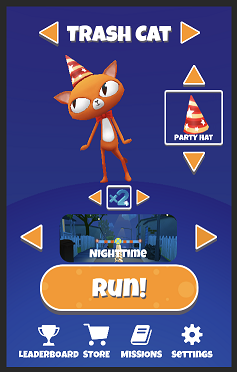
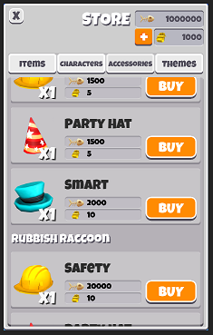

# Game systems

## Inventory

An inventory is a way of keeping track of a collection of items, as well as how many of those items exist in that collection. Some basic examples of inventories would be a backpack or a chest.

*Example: the main inventory contains characters, hats, bonuses, and themes.*

Inventories will have a **runtime instance** (inventories are collections which are Game Items) and a **definition**.
Game Foundation automatically creates a ‘main’ inventory by default, so you don’t need to define any inventories in advance.

## Wallet

The Wallet is a special kind of inventory which only contains currencies. A good  example for using the Wallet system is in casual mobile games where the player can accumulate one or more types of currency, such as coins, gems, etc. A default wallet is automatically created, and you can access and manage that default wallet conveniently with the Wallet class.

*Example: a player’s wallet, containing two types of in-game currency.*

## Stat

In Game Foundation, you can use Stats to track and manage any numeric values in your gameplay, such as the health of a character, damage point of a weapon, or how many times the player has beat the level.
The numeric types currently supported are Float (C# System.Single) and Int (C# System.Int32). Once you choose which numeric type a stat is, it cannot be changed later. This restriction is in place to avoid conversion problems for values saved in players’ persisted data files.

## Runtime persistence

With runtime persistence, you can save the state of the game to a local file, and then load it up again at a later time. 

## Analytics

This system lets you easily record game analytics  without writing a single line of code for data-instrumentation. You can then analyze the data later once the game is live to make data-informed decisions about your games. You can enable or disable editor or runtime Analytics in the Game Foundation settings by adding / removing the Analytics Detail.
