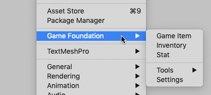

# Installing the Game Foundation package

1. In the Unity Editor, open the Package Manager window 
    (menu: **Window** → **Package Manager**).
    
    

2. In the **Package Manager** window, click **Advanced** and make sure that **Show preview packages** is enabled.
    
    

3. In the list of packages on the left, find **Game Foundation** and select it.
    
    

4. In the upper right, click on the **Install** button.                                                                 
    
    

5. After installation, the Game Foundation menu items and editor windows are available in your Unity project in the **Window** menu.        
    
    

## Quick start

Before Game Foundation can be used during runtime, it has to be initialized in your code. 
The following is an example of initializing Game Foundation with the Awake method of a MonoBehaviour.

```Csharp
using UnityEngine;
using UnityEngine.GameFoundation;

public class MyGameManager : MonoBehaviour
{
    void Awake()
    {
        GameFoundation.Initialize();
    }
}
```

When you initialize Game Foundation, the 'Main' and 'Wallet' inventories are automatically instantiated.

* **Tip:** To verify that Game Foundation is working and installed correctly, you can verify that the 'Main' and 'Wallet' inventories are present at startup.

```Csharp
using UnityEngine;
using UnityEngine.GameFoundation;

public class MyGameManager : MonoBehaviour
{
    void Awake()
    {
        GameFoundation.Initialize();

        foreach (Inventory inventory in InventoryManager.GetInventories())
        {
            Debug.Log($"Found inventory named: {inventory.displayName}");
        }
    }
}
```

After implementing the above code, when you press Play in your game you should see a successfully installed and initialized Game Foundation with a Main inventory and a Wallet.


Now you can head over to the [Tutorials page](GFTutorial.md) to learn how define your game's data in Game Foundation, starting with currencies, items, and stats.
